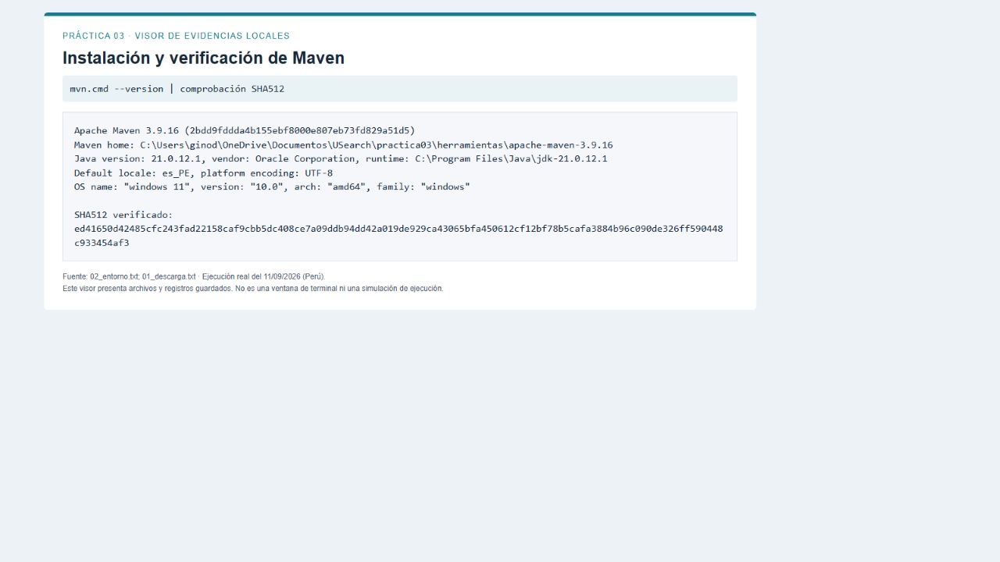
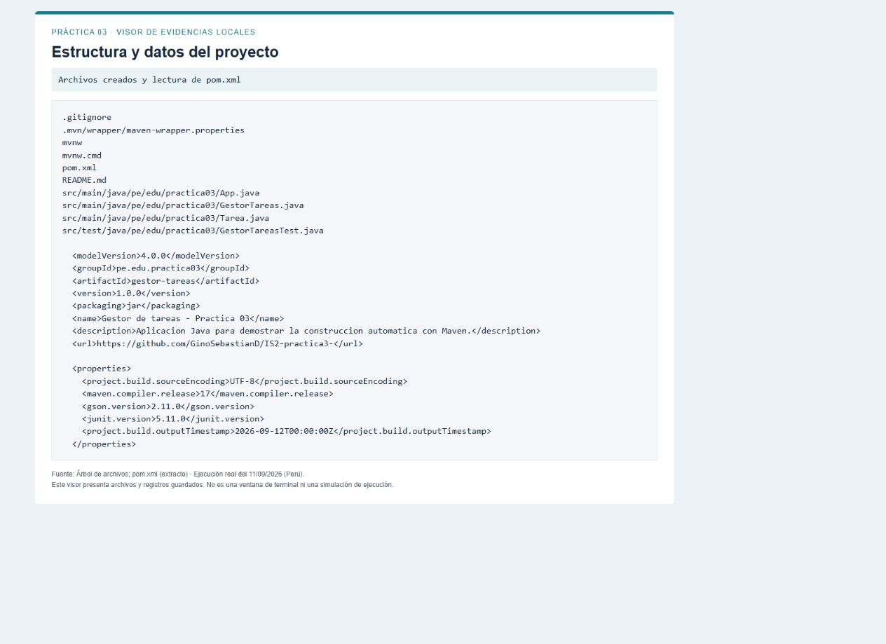
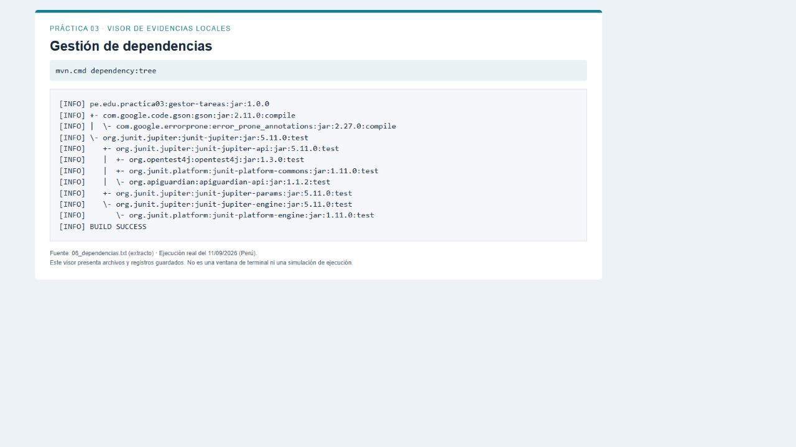
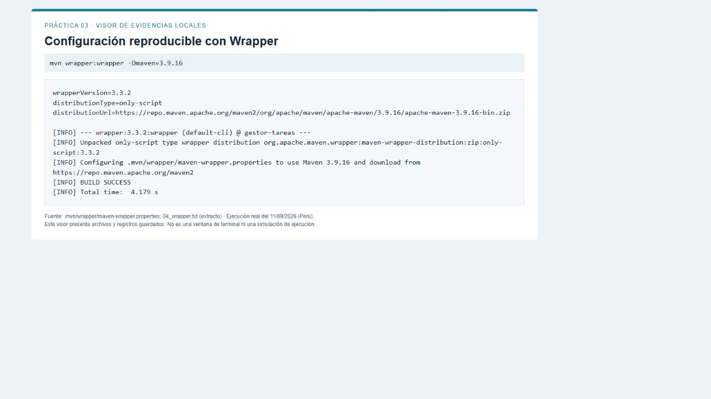
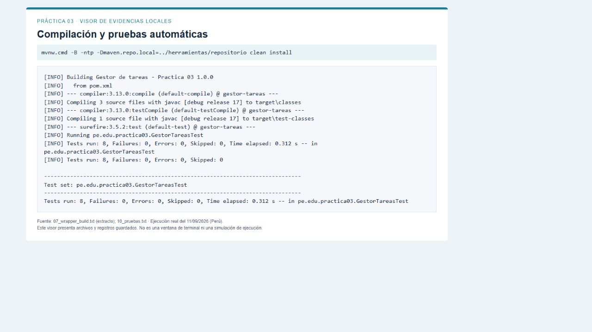
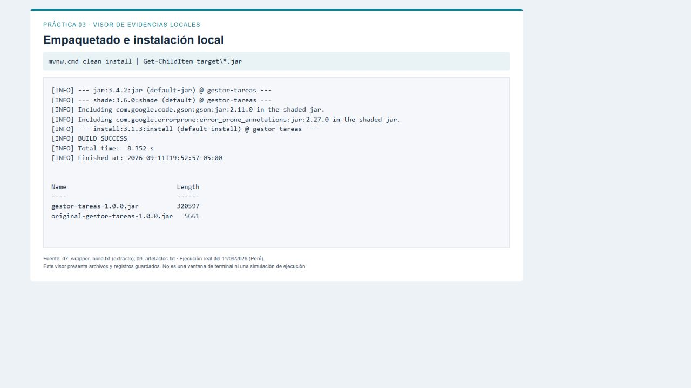
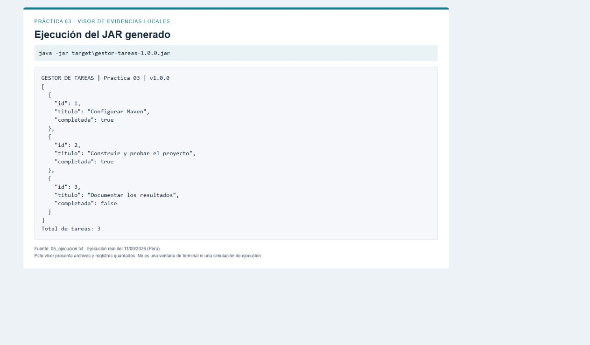
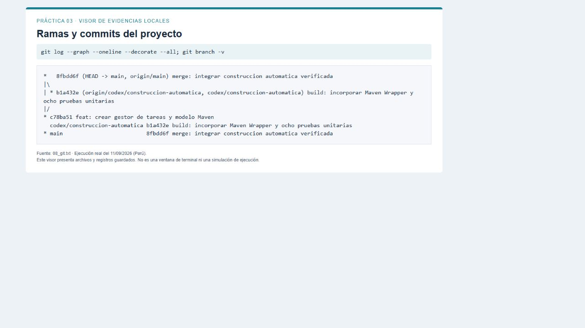
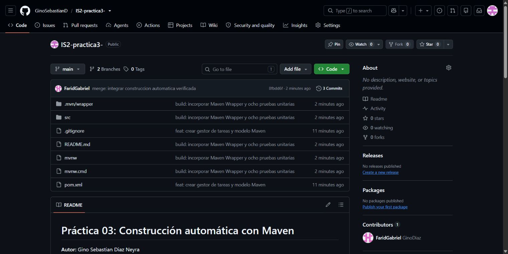

# Práctica 03: Construcción automática

Gino Sebastian Diaz Neyra

Ingeniería de Software II

**Estudiante:** Gino Sebastian Diaz Neyra

**Curso:** Ingeniería de Software II

**Carrera:** Ciencia de la Computación

**Docente:** DSc. Edgar Sarmiento Calisaya

**Fecha de ejecución:** 11 de septiembre de 2026 (Perú)

**Proyecto:** Gestor de tareas, versión 1.0.0

<a href="https://github.com/GinoSebastianD/IS2-practica3-" color="#147d92">Repositorio: GinoSebastianD / IS2-practica3-</a>

Informe técnico y tutorial con capturas de configuración, construcción, pruebas, ejecución y control de versiones.

## 1. Objetivo y alcance

Construir un proyecto de software mediante un modelo que centralice la información del proyecto, las opciones del compilador, las dependencias, las pruebas y el empaquetado. Se desarrolla la práctica de acuerdo con las actividades y entregables de Pr_3_Automatic_Build.pdf.

**Proyecto elegido.** Un gestor de tareas de consola permite registrar títulos, completar tareas y exportarlas a JSON. La implementación usa tres clases de producción: App, GestorTareas y Tarea. El almacenamiento es en memoria; la ejecución de demostración no conserva datos entre sesiones.

**Investigación previa.** Maven emplea un modelo XML llamado pom.xml; Gradle permite definir tareas mediante scripts; CMake configura la construcción de proyectos, especialmente C/C++. Se elige Maven por la estructura convencional de Java y porque permite demostrar con un mismo modelo la compilación, las pruebas y el empaquetado. Fuentes: referencias [1], [5] y [6].

**Entorno utilizado.** Windows 11 de 64 bits, PowerShell, Git, JDK 21.0.12.1 y Maven 3.9.16. Se configuró la construcción localmente, opción permitida por la actividad 1. El código se compila con compatibilidad Java 17 mediante release=17.

**Correspondencia con la guía:**
Actividad 1: instalación y configuración, secciones 2 y 5.
Actividad 2: modelo y dependencias, secciones 3 y 4.
Actividad 3: construcción, secciones 6 y 7.
Actividad 4: revisión y ejecución, secciones 6 a 8.
Entregables: GitHub con ramas y commits, pom.xml y este tutorial.

**Procedencia de las capturas.** Las figuras 1 a 8 son capturas de navegador de un visor local que presenta archivos y registros obtenidos de ejecuciones reales. No representan una terminal o un IDE. Los extractos están identificados y los registros completos se adjuntan en docs/registros. La figura 9 es una captura directa de GitHub.

## 2. Instalar y comprobar Maven

**Paso 1.** Verificar que el JDK está instalado ejecutando java -version y javac -version. En este equipo ambos componentes ya estaban disponibles. No fue necesario reinstalar Java.

**Paso 2.** Descargar de Apache el ZIP binario de Maven 3.9.16 y su archivo SHA512, comparar el hash con Get-FileHash y extraer el ZIP en herramientas. La comparación coincidió. La instalación manual sigue la referencia [2].

```powershell
java -version
javac -version
Get-FileHash .\herramientas\maven.zip -Algorithm SHA512
Expand-Archive .\herramientas\maven.zip .\herramientas
& .\herramientas\apache-maven-3.9.16\bin\mvn.cmd --version
```

**Paso 3.** Invocar mvn.cmd mediante su ruta local. No se modificó el PATH permanente. Para otra sesión se puede seguir usando la ruta completa o el Wrapper incluido en el proyecto.



**Resultado.** Maven reconoce el JDK y puede iniciar la construcción. La carpeta herramientas está fuera del repositorio del proyecto.

## 3. Crear el proyecto y su modelo

**Paso 4.** Clonar el repositorio indicado y crear manualmente la estructura convencional src/main/java y src/test/java. El arquetipo mostrado en la guía es un ejemplo; aquí se construyó un proyecto propio con esa estructura.

```powershell
git clone https://github.com/GinoSebastianD/IS2-practica3-.git
cd IS2-practica3-
```

**Paso 5.** Crear pom.xml en la raíz. Se especifican groupId=pe.edu.practica03, artifactId=gestor-tareas, version=1.0.0, packaging=jar, nombre, descripción y URL. Las propiedades fijan UTF-8 y maven.compiler.release=17.



**Resultado.** Maven identifica qué construir y la versión del lenguaje de destino. El compilador utilizado es javac del JDK 21, con --release 17; esto no equivale a haber instalado JDK 17.

## 4. Declarar y resolver dependencias

**Paso 6.** Declarar en pom.xml Gson 2.11.0 para generar JSON y JUnit Jupiter 5.11.0 para las pruebas. Gson usa el ámbito compile predeterminado; JUnit usa test y queda fuera del JAR ejecutable.

```powershell
<dependency>
  <groupId>com.google.code.gson</groupId>
  <artifactId>gson</artifactId>
  <version>${gson.version}</version>
</dependency>
<!-- JUnit: org.junit.jupiter:junit-jupiter:5.11.0, scope=test -->
```

**Paso 7.** Ejecutar dependency:tree para visualizar las dependencias directas y transitivas. En la ejecución se destinó la caché local a ../herramientas/repositorio; esta ruta no forma parte del código publicado.

```powershell
.\mvnw.cmd dependency:tree
```



**Resultado.** Las bibliotecas son resueltas por Maven; no es necesario copiar JAR manualmente al proyecto.

## 5. Fijar Maven con el Wrapper

**Paso 8.** Generar Maven Wrapper 3.3.2 para fijar Maven 3.9.16. Se agregaron mvnw, mvnw.cmd y .mvn/wrapper/maven-wrapper.properties al control de versiones. Referencia [3].

```powershell
mvn org.apache.maven.plugins:maven-wrapper-plugin:3.3.2:wrapper `
  -Dmaven=3.9.16
.\mvnw.cmd --version
```

El comando anterior se ejecuta desde la raíz del proyecto con Maven disponible; en este equipo se usó la ruta al mvn.cmd instalado. Para quien clone el repositorio, basta el JDK y ejecutar el Wrapper ya incluido.



**Configuración aplicada en esta ejecución.** MAVEN_USER_HOME se dirigió a .tools, y maven.repo.local a ../herramientas/repositorio. Son ubicaciones de caché locales. Sin estas opciones Maven usa sus ubicaciones habituales en el perfil del usuario.

**Incidencia resuelta.** La primera descarga del Wrapper fue bloqueada por las restricciones de red del entorno. Tras habilitar el acceso solicitado a la distribución oficial, el mismo comando terminó correctamente. No se modificaron el código ni las versiones para resolverlo.

## 6. Compilar y ejecutar las pruebas

**Paso 9.** Ejecutar clean install en la raíz del proyecto. Maven lee pom.xml, limpia target, compila las clases de producción y después las de prueba. Surefire ejecuta los casos de JUnit.

```powershell
$env:MAVEN_USER_HOME = Join-Path (Get-Location) ".tools"
.\mvnw.cmd -B -ntp `
  "-Dmaven.repo.local=../herramientas/repositorio" clean install
```



**Casos comprobados:** lista inicialmente vacía; creación con identificadores y normalización de títulos; rechazo de título vacío; rechazo de null; completar una tarea; rechazo de ID inexistente; lista no modificable; JSON correcto con comillas y acentos.

**Resultado.** Tests run: 8, Failures: 0, Errors: 0, Skipped: 0. Se generaron informes TXT y XML de Surefire en target/surefire-reports. Las ocho pruebas finalizaron en 0.312 segundos en la ejecución con Wrapper.

## 7. Empaquetar e instalar localmente

**Paso 10.** El mismo clean install continúa hasta package e install. Maven Jar produce el JAR base y Shade agrega Gson y configura pe.edu.practica03.App como clase principal. Install copia el artefacto y su POM al repositorio local. Referencias [1] y [4].



**Artefacto para ejecutar:** target/gestor-tareas-1.0.0.jar, de 320 597 bytes. El archivo original-gestor-tareas-1.0.0.jar (5 661 bytes) es el JAR anterior a la inclusión de dependencias y no es el ejecutable que se entrega.

**Resultado global.** BUILD SUCCESS. La primera construcción con Maven local tardó 42.391 segundos; la construcción posterior con Wrapper y dependencias en caché tardó 8.352 segundos. Son tiempos observados en este equipo, no una comparación de rendimiento entre herramientas.

**Advertencias observadas.** Shade informó recursos duplicados de MANIFEST.MF y module-info entre los JAR. Se conservaron en el registro completo. No detuvieron la construcción; el manifiesto de entrada se configura con el transformer y la ejecución posterior del JAR funcionó correctamente. No se validó su uso como módulo JPMS.

**Distinción.** install significa instalar en el repositorio local de Maven. La publicación de fuentes en GitHub se realiza posteriormente con Git.

## 8. Ejecutar y verificar el resultado

**Paso 11.** Ejecutar el archivo creado, sin configurar un classpath externo:

```powershell
java -jar target\gestor-tareas-1.0.0.jar
```



**Resultado.** La aplicación inicia, carga Gson desde el paquete y muestra tres tareas. Las tareas 1 y 2 aparecen completadas; la tarea 3 está pendiente. Estos valores son datos fijos de demostración, no un indicador del estado del informe.

La ejecución finaliza normalmente. Esto comprueba que el artefacto construido puede ejecutarse y que la dependencia de serialización está disponible en el JAR.

## 9. Registrar cambios y ramas

**Paso 12.** Guardar el proyecto inicial en main y crear la rama codex/construccion-automatica para agregar el Wrapper, las pruebas y el tutorial inicial. Integrar la rama mediante un merge que conserva el historial.

```powershell
git add .gitignore pom.xml src/main
git commit -m "feat: crear gestor de tareas y modelo Maven"
git switch -c codex/construccion-automatica
# Agregar Wrapper, pruebas y README
git add README.md src/test mvnw mvnw.cmd .mvn
git commit -m "build: incorporar Maven Wrapper y ocho pruebas unitarias"
git switch main
git merge --no-ff codex/construccion-automatica
git push -u origin main codex/construccion-automatica
```



**Commits del desarrollo:** c78ba51 crea el proyecto; b1a432e incorpora Wrapper y ocho pruebas; 8fbdd6f integra la rama en main. El informe y las evidencias se añaden posteriormente en un commit de documentación.

**Resultado.** Ambas ramas están publicadas. Los archivos generados de target y las cachés se excluyen con .gitignore.

## 10. Verificar el proyecto en GitHub

**Paso 13.** Abrir el repositorio y comprobar que aparecen el código, pom.xml, el Wrapper y README.md. La interfaz muestra dos ramas y los tres commits de construcción en el momento de la captura.

<a href="https://github.com/GinoSebastianD/IS2-practica3-" color="#147d92">https://github.com/GinoSebastianD/IS2-practica3-</a>



**Entregable 1.** Proyecto GitHub con historial y ramas: enlace anterior.

**Entregable 2.** Modelo de construcción: <a href="https://github.com/GinoSebastianD/IS2-practica3-/blob/main/pom.xml" color="#147d92">pom.xml en GitHub</a>. También se incluye como archivo independiente en el paquete de entrega.

**Entregable 3.** Este informe constituye el tutorial de herramienta, configuración y construcción. El repositorio incorpora una copia en docs, las capturas PNG y los registros originales.

## 11. Reproducción y conclusiones

**Reproducción desde otra carpeta.** Con Git y JDK 17 o superior instalados, utilizar la siguiente secuencia. La primera ejecución requiere Internet para Maven y las dependencias; los tiempos y las rutas locales pueden variar.

```powershell
git clone https://github.com/GinoSebastianD/IS2-practica3-.git
cd IS2-practica3-
.\mvnw.cmd -B -ntp clean install
java -jar target\gestor-tareas-1.0.0.jar
```

**Conclusiones.** El modelo pom.xml concentra la información del proyecto, las opciones de compilación y las dependencias. Con un comando se ejecutó la construcción completa, se aprobaron ocho pruebas y se obtuvo un JAR funcional. El Wrapper fija la versión de Maven y Git conserva la evolución en ramas y commits.

**Alcance de la verificación.** Se verificó la construcción local en Windows y la publicación de fuentes en GitHub. No se configuró un servicio de integración continua ni un despliegue en servidor, ya que las actividades de la práctica no los exigen. La aplicación de demostración conserva datos solo en memoria.

## 12. Referencias

<a href="https://maven.apache.org/guides/getting-started/maven-in-five-minutes.html" color="#147d92">[1] Apache Maven. Maven in 5 Minutes</a>

<a href="https://maven.apache.org/install.html" color="#147d92">[2] Apache Maven. Installation y distribución binaria</a>

<a href="https://maven.apache.org/tools/wrapper/" color="#147d92">[3] Apache Maven. Maven Wrapper</a>

<a href="https://maven.apache.org/plugins/maven-shade-plugin/" color="#147d92">[4] Apache Maven. Shade Plugin</a>

<a href="https://docs.gradle.org/current/userguide/userguide.html" color="#147d92">[5] Gradle. User Manual</a>

<a href="https://cmake.org/cmake/help/latest/guide/tutorial/index.html" color="#147d92">[6] CMake. Tutorial</a>

[7] Sarmiento Calisaya, Edgar. Práctica 03: Construcción automática. Guía del curso Ingeniería de Software II, Pr_3_Automatic_Build.pdf, 4 páginas. Documento proporcionado para esta práctica.
